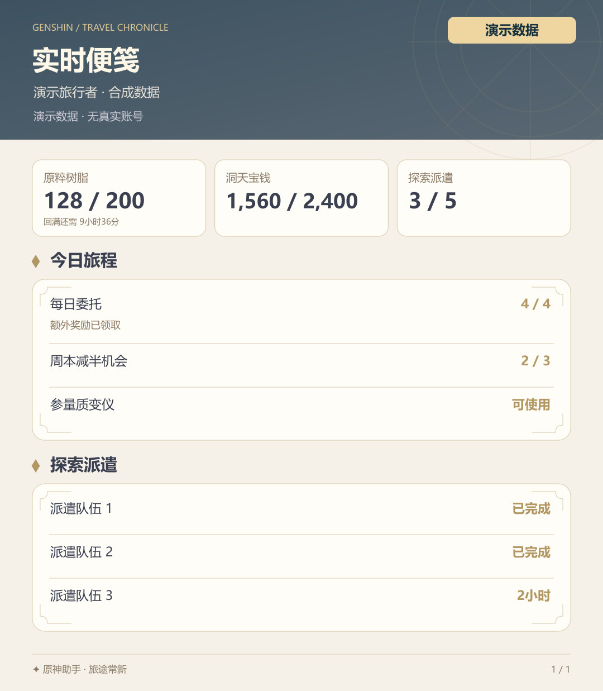
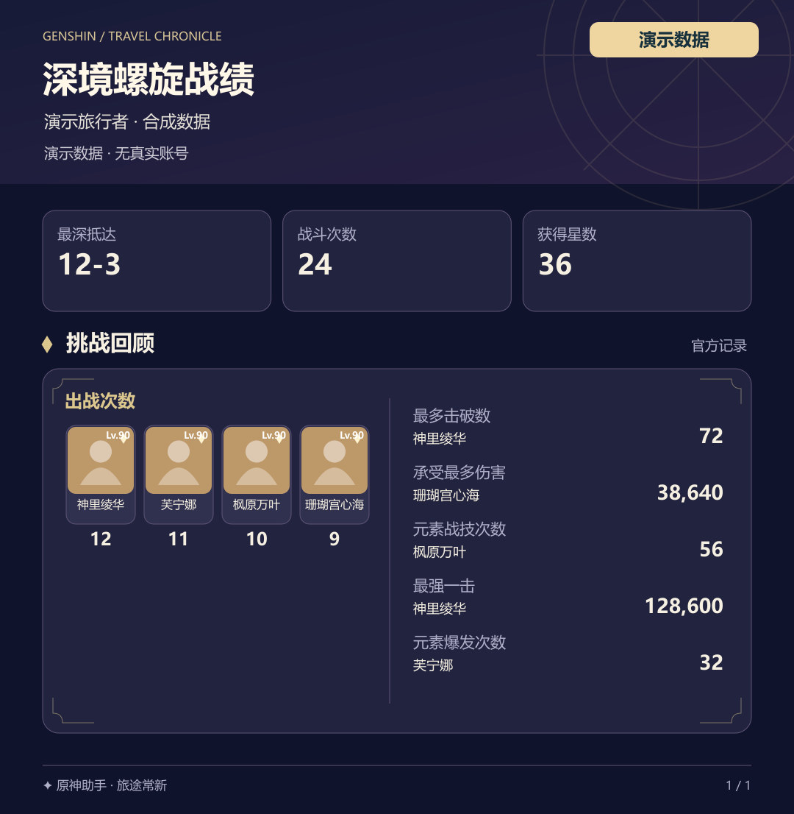
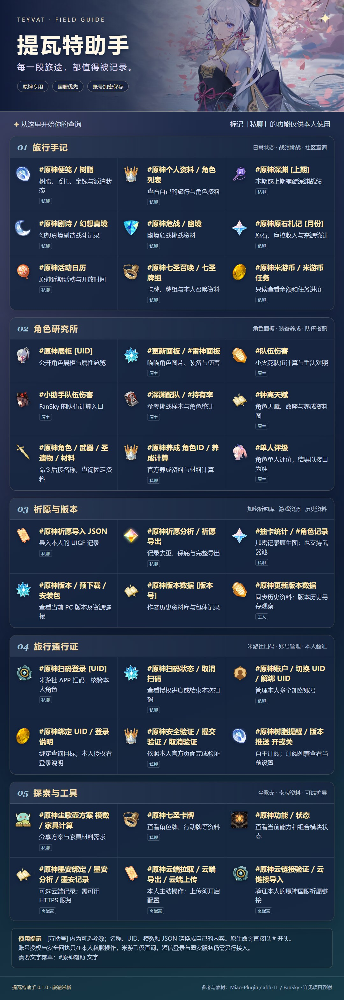

# 原神助手 · Genshin-Plugin


**从每日树脂到深渊战绩，让旅行记录更清楚，让常用查询更顺手。**

[效果预览](#效果预览) · [独立使用](#独立使用) · [TRSS/云崽组合](#trss云崽组合) · [功能清单](docs/FEATURES.md) · [数据与来源](#数据与来源)

## 效果预览

<table>
  <tr>
    <td width="50%" valign="top"><strong>实时便笺</strong><br>树脂、宝钱、委托与探索派遣，用一张卡片查看。<br><br></td>
    <td width="50%" valign="top"><strong>深境螺旋</strong><br>星数、出战次数与挑战摘要，用深蓝主题记录。<br><br></td>
  </tr>
</table>

以上图片由插件现有原生记录卡片渲染器离线生成，全部为合成演示数据，不含 UID、真实账号或个人记录。深渊示例保留缺少本地素材时的原生占位头像。安装依赖后运行 `node scripts/generate-readme-demo.mjs` 可重新生成。

<details>
<summary>展开查看完整命令帮助图</summary>



</details>

## 功能亮点

- **日常与挑战都有卡片**：便笺、深渊、剧诗、角色、札记等 17 类本人记录支持原生图片；命令末尾加 `文字` 可查看全文。
- **资料与祈愿集中查询**：固定游戏资料、公开展柜、本地 UIGF 导入分析与 PC 包体版本信息，配合可选原生模块使用。
- **账户按本人隔离**：国服米游社扫码、加密多账户管理与自主订阅；个人记录仅本人私聊，授权状态和功能验收范围明确展示。

<details>
<summary>当前接入范围与验证说明</summary>

项目仓库：[719083594/Genshin-Plugin](https://github.com/719083594/Genshin-Plugin)。默认命令继续使用 `#原神`。

Bot 中 `#原神帮助` 默认直接读取并校验随包发布的插画分类图，保留常用命令、本人私聊标记及需配置的功能，无需启动浏览器。发送 `#原神帮助 文字` 查看文字版。自定义前缀通过宿主共用浏览器的独立临时上下文生成图片，并以内存 Buffer 发送；失败时回退文字，CLI 与独立 API 默认仍返回文字。素材来源与图片边界见 [图片界面](docs/IMAGE-UI.md)。

原神专用 Node.js 插件，国服优先。独立核心提供账户隔离、加密授权、公开展柜、个人记录请求、资料、本地祈愿和用户订阅；TRSS/云崽可组合原喵喵、小火花、FanSky 与 genshin 的原神模块。

当前 **0.1.0 尚未覆盖五个参考项目的全部原神功能**。本人国服扫码授权并 AES 保存一个账户已经成功，剧诗、幽境危战、札记和七圣牌组的真实个人 API 已返回成功。个人资料、便笺与深渊此前出现 5003/1034；官方设备指纹部署后，本人已在 bot 私聊完成人工极验，日志确认官方接受回执，用户反馈三项 QQ 命令均正常。用户也确认 `#钟离天赋` 正常收到原生图片；这些结果不代表全部字段、账号、图片、伤害或群榜通过。墨安服务和短信登录仍待完成；本人授权的米游币余额/任务状态两个官方只读接口已返回成功；作者历史包体资料已加入，未承诺任意历史版本齐全。国服 PC 可查询当前/预下载资源大小和链接并保留本机观察历史。见 [功能与差异清单](docs/FEATURES.md)。

</details>

## 独立使用

`#原神版本数据 [版本号]` 查询 GamePush 作者的原神历史包体资料，内置初始 57 条正式/53 条预下载记录；主人 `#原神更新版本数据` 从固定 HTTPS 来源同步新增记录。作者记录的历史大小与当前启动器资源统计分开显示，缺失版本不补造；`#原神包体历史` 仍是本机开始运行后的观察记录。

需要 Node.js 22.15 或更新版本；独立文字/API 核心使用 Node 内置模块，扫码 PNG 需要 qrcode，记录图片使用随包声明的 sharp 0.35.5。首次安装执行 `npm ci`。

```sh
node cli.mjs init
node cli.mjs diagnose
node cli.mjs login YOUR_QQ
node cli.mjs command YOUR_QQ "#原神帮助"
```

公开查询可用 `#原神展柜 UID`、`#原神角色 胡桃`、`#原神武器 武器名`、`#原神版本`。自己的账户使用 `#原神绑定 UID`、`#原神账户`、`#原神切换 UID`、`#原神解绑 UID` 管理；UID 绑定只建立查询目标，不代表登录成功。

国服可私聊 `#原神登录 [可选UID]`，用本人米游社 App 扫码并在官方页面确认；`#原神扫码状态` 查询，`#原神取消扫码` 取消。已验证真实创建、pending、本人确认及角色验证，并成功加密保存一个国服账户；不会推断其他账号、渠道或国际服同样通过。二维码票据仅留内存，账户写入 AES 库。CLI `login YOUR_QQ [UID]` 直接显示终端二维码，不写 PNG 到磁盘。也可私聊 `#原神绑定Cookie UID Cookie` 验证并加密保存，不接受密码。

国服查询遇到 1034 时，保持所选账户，私聊 `#原神安全验证`，打开收到的 `Miyoushe-Verification.html` 并亲自操作官方极验。QQ 内置浏览器不支持时，可下载 HTML 在系统浏览器打开；把成功后生成的完整 `#原神提交验证 nonce 回执` 命令复制回同一 QQ 私聊。五分钟有效，`#原神取消验证` 可清理，切换或解绑会自动取消。HTML 不含 Cookie/UID/设备标识，会话和回执仅在内存；没有第三方 solver 或自动解题。本轮本人已完成此流程，官方接受回执的日志标记与用户对 `#原神便笺`、`#原神深渊`、`#原神个人资料` 均正常的反馈相互印证；尚未逐字段与 App 核对，不保证其他账号永久免验证。详见 [验收状态](docs/VERIFICATION.md)。

授权后可以请求便笺、深渊、剧诗、幽境危战、角色、养成、活动日历和七圣召唤。新增 `#原神札记 [月份]` / `#原神原石札记 [月份]`、`#原神尘歌壶方案 模数`、`#原神家具计算 JSON`、`#原神七圣牌组` 与 `#原神七圣卡牌`。剧诗、危战、札记、牌组已经验证本人真实 API；家具/卡牌等尚需逐项响应验收。家具计算 JSON 为 `{"list":[{"id":家具ID,"cnt":数量}]}`，模数为 10 至 15 位数字。

Bot 本人私聊中的 17 类记录默认生成图片：便笺、个人资料、深渊、剧诗、危战、角色列表与详情、活动日历、札记、七圣概览/牌组/卡牌、养成计算、尘歌壶方案/家具计算、米游币余额/任务。挑战页使用深蓝金色，其他页使用米白金色；深渊分层展示星数与上下半队伍，空记录单独显示。原命令末尾加 `文字` 可查看易读全文，过长时通过内存文件发送。个人记录只允许本人私聊，图片以 Buffer 发送且不写个人图片缓存。CLI/独立 API 默认文字/JSON 协议保留，显式 export 才写用户指定文件。国际服按 UID 分流至 HoYoLAB，当前扫码仅国服，国际服 Cookie/个人接口仍需逐项账户验收。

记录图片不需要浏览器或 AI 模型。插件自带原生转换器，安装 AI-Plugin 时可优先复用它的纯图片服务，缺少 AI 时自动使用本地转换器。头像优先读取已安装 miao-plugin 的公开角色素材，否则尝试官方公开图片；图片不可用时保留角色名与等级。字段映射、分页与验证范围见 [记录图片](docs/RECORD-IMAGES.md)，跨插件调用见 [共享渲染](docs/SHARED-RENDERER.md)。

祈愿文件在本地导入、去重、分析和导出，不依赖墨安：

```sh
node cli.mjs import YOUR_QQ UID INPUT.json
node cli.mjs export YOUR_QQ UID OUTPUT.json
```

支持原神 UIGF v2.2/v2.3/v2.4/v3.0/v4.0/v4.1/v4.2，默认导出 v4.2；API 可指定旧版，无法无损转换时会拒绝。聊天中可私聊 `#原神祈愿导入 JSON`、`#原神祈愿分析`、`#原神祈愿导出`。垫抽只按已有记录计算，不能补回未取得的历史。原生 `#角色记录`、`#武器记录`、`#常驻记录`、`#集录记录`、`#抽卡统计`（含喵喵别名）现从当前 QQ/UID 的 AES 祈愿库读取，仅本人私聊；图片仅在已有宿主浏览器的独立临时上下文生成内存 Buffer，不写明文 HTML/JSON/图片缓存，不另起浏览器。资料不明、历史 UP 未知、排序不确定或浏览器尚未启动时明确拒绝绘图。完整真实祈愿图片尚待本人记录验收。

`#原神安装包` / `#原神包体`、`#原神预下载包`、`#原神包体历史` 查询国服 PC 官方资源元数据。大小默认含游戏本体与中文语音，其他语音分列在 API 结果中；Sophon 清单链接不是可直接安装的 ZIP。传统 ZIP 接口可能仍是旧版本，消息会显示其真实版本，不把旧包作为最新安装包。观察历史最多 200 次变化，资源大小不等于最终磁盘或临时空间需求。

## TRSS/云崽组合

放入宿主 `plugins/Genshin-Plugin`，把实例 `config/local.json` 的 `adapter` 设置为 `yunzai`。外部源保持原目录名与原许可，原根入口改为独立空 apps 导出，选择器直接导入已审计模块，避免重复注册与原入口自动初始化。依赖、设置脚本、首次完整重启与真实命令验收见 [组合安装说明](docs/NATIVE-PROVIDERS.md)。

`genshin`（原神基础模块）、`miao-plugin`（喵喵面板）、`xhh-TL`（小火花功能）和 `FanSky_Qs`（枫叶计算）是由原神助手统一加载的依赖模块，非废弃插件。它们的原根入口没有独立注册功能，实际功能归入原神助手；不能因面板显示 0 个独立入口就删除源码或资源。公开的 `orangejuice.plugin.json` 使用 `components` 声明这些关系，供管理面板将依赖收纳到原神助手下。

`providers.miao/genshin/xhh/fanSky` 默认关闭，只有安装并核对加载结果后才启用。选择器返回 `loaded/partial/error/missing/disabled`；开关 true 不等于导入成功。喵喵使用 `#喵喵帮助`，小火花队伍计算使用 `#队伍伤害`，FanSky 对照入口使用 `#小助手队伍伤害`。原生 Cookie/UID 写库、公共 CK 和 authkey 缓存入口停用；组合从当前 QQ 的 AES 账户只在本次处理内取得临时读对象，不复制到原生 DB 或 Redis CK 池。

包含面板/原生文件/Redis 缓存加密的最新源码已线上部署，32 个原生选择类与独立核心共 33 类加载成功，无构造失败；本轮六个容器健康检查通过，账户成功解密保留，两个插件帮助命令均获用户回复确认。真实 Redis Lua 合成旧数据迁移、凭据剥离、排名顺序和原始键删除均已通过，测试键已清理。原生图片已有 `#钟离天赋` 用户确认正常收到这一条，全部个人面板、伤害、群榜与自动推送仍需分别验收。

固定 genshin 快照没有扫码实现；本项目使用原创 `#原神登录`。原裸 `#绑定Cookie` 和 Cookie 自动检测因明文存储停用，账户统一用本项目加密入口管理。会话桥只提供核对过的只读协议，已加入札记、家具和七圣牌组/卡牌；未核验的旧图片与个人响应仍须验收。UserGame、stoken、充值 authkey 等接口不会转入原生公共池；独立核心已接入官方签发的设备指纹和仅供本人的人工验证入口。本轮本人完成验证后，便笺、深渊、个人资料三项 QQ 命令获用户正常反馈，不扩展为其他接口或账号均已通过。

独立订阅为 `#原神树脂提醒 开/关 [阈值]`、`#原神版本推送 开/关`、`#原神订阅列表`。默认 `notifications.enabled` 关闭；需要主人启用总开关并由用户主动订阅。无订阅不请求接口、不发消息；真实发送取决于在线协议端和适配器。

## 数据与来源

QQ、账号 UID、备注、Cookie 与账户滚动备份采用 AES-256-GCM 加密，个人墨安 Key、整份独立祈愿和订阅路由/去重状态也加密保存。祈愿文件名以密钥和 QQ/UID 对应的 AAD 计算 HMAC-SHA256，不在路径暴露 QQ/UID。旧独立祈愿和订阅在启动/读取时迁移加密，回验后清理确认未变的旧文件，失败保留并报错。

新增原生缓存保护覆盖 miao 原神 PlayerData/旧 UserData、札记 NoteData、FanSky 面板/成就宝箱榜文件、xhh resin_timer，以及列明的角色榜、收藏、用户偏好、冷却和小火花 Redis 命名空间；正文与受控 Redis 键/成员/分数全加密，文件路径隐藏账号标识，原生凭据字段不存入缓存。适配器已部署并加载，真实 Redis Lua 合成迁移验收通过；具体范围和旧 Redis 原子迁移要求见 [组合说明](docs/NATIVE-PROVIDERS.md)。账户桥与缓存适配不是任意第三方代码的文件沙箱，未审计的新路径不自动获得相同保证。

改名时须完整保留原实例的 `config/local.json`、加密数据与备份，再将插件目录调整为 `plugins/Genshin-Plugin`。内部 `Teyvat` API 导出、`TEYVAT_ACCOUNT_KEY` 环境变量、AES 存储标识和账户文件格式保持兼容，不要为改名重新生成密钥。

随机密钥留在被 Git 忽略的 `config/local.json`，保存密钥才能解密。原生账号写库和全局 CK 池停用，临时查询授权在处理结束后失效。私聊文件使用内存上传；用户显式 CLI export 产生的明文 UIGF 是主动交换例外。所有实例数据不提交 GitHub。

参考项目、固定版本、代码许可、实际 API 与仅作参考的来源见 [致谢](docs/CREDITS.md) 和 [逐功能源码审计](docs/FEATURE-AUDIT.md)。MATOOL 原仓库没有明确 LICENSE，本项目未复制其代码。原创墨安客户端默认关闭、服务尚未接通，需要另配核验过的 HTTPS 地址；本人 Key 私聊加密保存，主动上传/云链接导入另有开关，不向发现的默认明文 HTTP 地址提交凭据。原创代码采用 GPL-3.0-or-later，miao 资料摘录保留 [MIT 原许可](resources/MIAO-LICENSE.txt)，游戏素材和文字属于各自权利人。

米游币仅提供本人私聊 `#原神米游币`、`#原神米游币任务`，复用当前已加密授权。2026-10-07 经本人明确允许，两个固定官方 GET 均返回 HTTP 200/retcode 0。按用户要求，手动/自动签到、点赞、分享与兑换不提供执行能力，旧签到配置和订阅会清除；任务查询中的“奖励已领取”只显示官方状态，不触发领奖。
