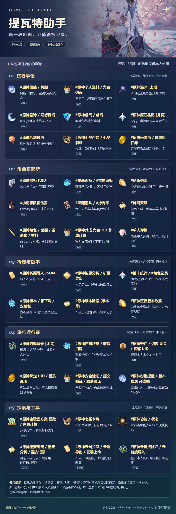

# 图片界面

`#原神帮助` 在 TRSS/云崽适配器中显示 1080 像素宽的插画分类菜单。旅行手记、角色研究、祈愿与版本、账户、探索工具分组排列，命令参数与私聊/主人/需配置标记保留。`#原神帮助 文字` 是文字入口，渲染失败也回退文字。

背景和图标来自致谢中固定 miao-plugin 快照的公开素材。菜单排版和渲染隔离实现为本项目原创，游戏图片的权利仍属于各自权利人。没有把用户聊天截图、头像、昵称或账号数字放入源代码或示例图。

`lib/card-renderer.mjs` 只使用宿主既有 Puppeteer Browser；首次需要时调用宿主 `browserInit`，不创建第二套浏览器。两个插件共用进程级渲染锁和启动 Promise，避免并行启动。每次生成独立 BrowserContext，禁用页面脚本、外部网络与缓存，最终图片只返回 JPEG Buffer。不写图片、HTML 或本人 JSON 临时文件，不使用宿主模板磁盘缓存。

TRSS 的默认渲染入口可能返回分发器，只有模板截图接口。适配器经 `host-bridge.mjs` 明确选择宿主 `loader.getRenderer('puppeteer')` 并核对实例协议；不把默认入口误认为有 `browserInit` 的后端。图片失败日志只记录固定错误代码，不记录 HTML、账户数据或原始异常正文。

独立渲染 API 默认等待关闭确认。bot 适配器显式分开交付与清理：图片通过完整校验、且已实际启动上下文关闭后即可发送；共享队列继续等待 `drain()` 的真实关闭确认，才允许下一张图建立页面。清理迟到不再丢弃有效图片；关闭失败或一直未确认时继续阻止新页面，不靠超时猜测已经清理。连续请求使用有界共享队列，本人查询图片不缓存。

默认前缀的公开帮助使用随包发布的 `resources/ui/help.jpg`，核验源码版本与图片 SHA-256 后直接发送，无需启动浏览器或排队。自定义前缀仍动态构建，并仅缓存公开帮助图十分钟。截图直接裁剪已校验的容器边界，省去元素截图的观察器、滚动和重复测量；阶段日志只含固定阶段耗时，不含账号或图片内容。多页后续失败时准确提示已发送页数，不再重复整份文字结果。

仅允许插件公开素材目录中的普通文件，拒绝符号链接、硬链接和越界路径。受控内存图只允许经尺寸与魔数检查的 PNG/JPEG；用于三国近期战绩的官方公开武将头像。HTML、页面尺寸、像素数、资源总量、图片大小和时间均有上限；清理失败时停止后续渲染。图片发送失败或浏览器繁忙时保留文字结果。

适配器显式传入 `imageReply:true` 启用帮助与记录卡片，独立 API/CLI 默认保持文字/JSON 协议。原生天赋、角色面板和祈愿图各自沿用已有实现。

本人私聊的 17 类记录新增独立 SVG→JPEG 页面，覆盖便笺、个人资料、深渊、剧诗、危战、角色、日历、札记、七圣与养成等。它们不使用上述浏览器路径，而使用固定版本 Sharp；安装 AI-Plugin 时可复用其纯转换服务，未安装时使用本插件自带转换器。原命令末尾加 `文字` 显示易读记录。字段与页数说明见 [记录图片](RECORD-IMAGES.md)。

记录模型仅包含列明的展示字段，未把原始 API 对象传给渲染器。头像优先读取 miao-plugin 公开目录中经 ID、目录边界与文件尺寸核验的角色图，缺少素材时仅向官方域名请求公开 PNG/JPEG/WebP；不发送 Cookie、用户 UID 或认证头。图片转换后只在内存缓存公开头像。本人记录 SVG/JPEG 不缓存、不落盘；输入、尺寸、像素和队列边界与 AI 共享服务一致。所有输出卡片保留私聊属性，在生成和交付前拒绝群事件。

本机真实 Chrome 已验证帮助图尺寸、两个本地素材加载、中文字体与无横向溢出。两插件帮助图和纯合成个人卡的临时上下文已验证关闭；个人测试不保存明文图片。文档预览只含公开内容。

